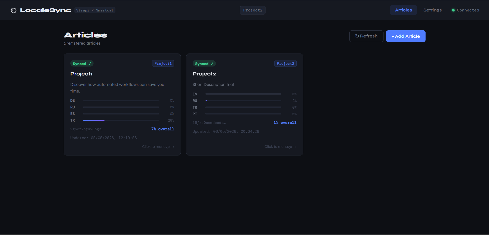
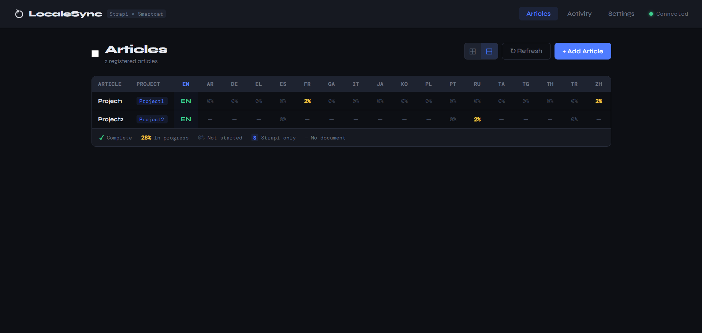
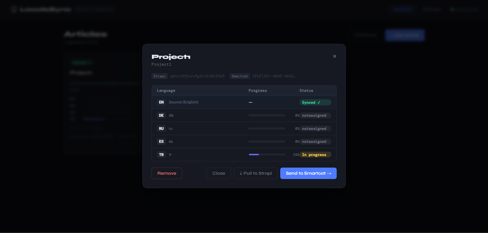
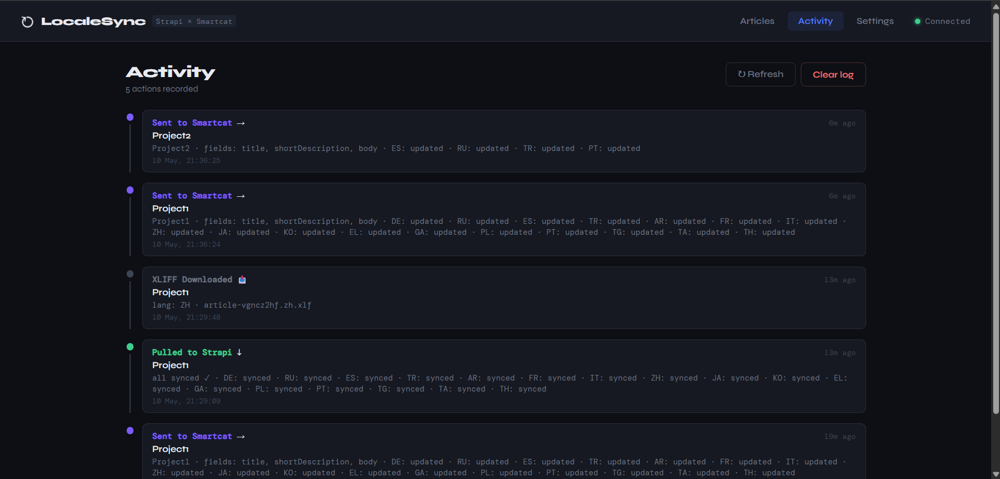

# LocaleSync

**A translation management dashboard connecting Strapi CMS with Smartcat**

LocaleSync bridges the gap between headless CMS content and professional TMS workflows. Register articles, push content to Smartcat, monitor per-language translation progress in real time, and pull completed translations back into Strapi — all from a single dashboard, with no manual copy-paste.

---

## Screenshots

**Articles — card view with per-locale progress bars**


**Locale matrix — full translation coverage at a glance**


**Article detail modal — locale status, XLIFF download/upload, diff view**


**Activity log — full audit trail of every pipeline action**


---

## Features

| Feature | Description |
|---|---|
| **Multi-article registry** | Register any Strapi article against any Smartcat project using their IDs |
| **Send to Smartcat** | Push `title`, `shortDescription`, `body` to Smartcat in one click |
| **Webhook auto-send** | Optionally trigger a send automatically when an article is published in Strapi |
| **Diff view** | Shows field-level changes since last send before pushing |
| **Pull to Strapi** | Import completed (or partial) translations back to Strapi locale versions |
| **QA report** | Validates pulled translations — placeholder integrity, HTML tag balance, empty fields, length anomalies |
| **XLIFF 1.2 & 2.0 support** | Download/upload `.xlf` files per locale — compatible with MemoQ, Trados, OmegaT, Phrase. Uploads auto-detect version |
| **Locale matrix view** | Table of articles × locales showing progress at a glance |
| **Locale parity check** | Detects mismatches between Strapi and Smartcat locales |
| **Initialize locales** | Copy source content into empty Strapi locale entries in one click |
| **Bulk operations** | Select multiple articles and send/pull them all at once |
| **Activity log** | Paginated audit trail of every send, pull, XLIFF action, and locale sync |
| **Multi-project support** | Each article is linked to its own Smartcat project independently |
| **Credential management** | All API keys stored in browser localStorage — nothing hardcoded on server |
| **Keyboard shortcuts** | `Cmd/Ctrl+K` to add an article, `Esc` to close modals, `R` to refresh |

---

## Architecture

```
React Dashboard (Vite + React 18)
         ↕  REST API
Express Middleware (Node.js)
    ↕                   ↕
Strapi CMS v5       Smartcat API v1
(content source)    (translation engine)
```

The Express server is **credential-agnostic** — all API keys are sent as request headers from the browser. Nothing is hardcoded on the server side, making the tool usable by anyone with their own Strapi and Smartcat accounts. The one exception is the optional webhook auto-send feature, which reads a small set of environment variables since Strapi's webhook call has no browser session to pull credentials from.

---

## Tech Stack

| Layer | Technology |
|---|---|
| Frontend | React 18, Vite, vanilla CSS with custom properties |
| API server | Node.js, Express |
| CMS | Strapi v5 |
| Translation platform | Smartcat API v1 |
| File formats | XLIFF 1.2 and 2.0 (zero dependencies, custom serializer/parser) |
| Credential storage | Browser localStorage |
| Article registry | SQLite (better-sqlite3) |
| Activity log | SQLite (same database) |

---

## Project Structure

```
localesync/
├── frontend/
│   └── src/
│       ├── App.jsx
│       ├── App.css
│       ├── api/
│       │   └── client.js              # All API calls + credential management
│       ├── hooks/
│       │   └── useKeyboardShortcuts.js
│       └── components/
│           ├── ArticlesPage.jsx       # Article grid with bulk selection
│           ├── ArticleModal.jsx       # Register · send · pull · XLIFF · locale sync
│           ├── DiffModal.jsx          # Field-level diff before sending
│           ├── QAReportModal.jsx      # Translation quality report after pull
│           ├── LocaleMatrix.jsx       # Articles × locales table
│           ├── LocaleSyncModal.jsx    # Strapi ↔ Smartcat locale parity
│           ├── ActivityPage.jsx       # Paginated activity timeline
│           ├── Skeleton.jsx           # Loading placeholders
│           ├── Header.jsx
│           ├── Settings.jsx
│           ├── StatusBadge.jsx
│           └── Toast.jsx
│
├── middleware/
│   ├── server.js                      # Express API — all endpoints
│   ├── db.js                          # SQLite connection + registry storage
│   ├── activityLog.js                 # SQLite-backed activity logger
│   ├── qaCheck.js                     # Translation QA validation
│   ├── xliff.js                       # XLIFF 1.2 & 2.0 serializer/parser
│   ├── migrate.js                     # One-time file → SQLite migration
│   ├── transform.js                   # Field mapping + placeholder validation
│   ├── jobTracker.js                  # Legacy CLI job state
│   └── sync.js                        # Legacy CLI pipeline runner
│
└── strapi-cms/                        # Local Strapi v5 instance
```

---

## Getting Started

### Prerequisites

- Node.js v20, v22, or v24
- A running Strapi v5 instance with i18n enabled
- A Smartcat account with at least one project containing uploaded documents

### 1. Clone the repo

```bash
git clone https://github.com/bunyamingenc/Smartcat-Integration-with-Strapi-CMS.git
cd Smartcat-Integration-with-Strapi-CMS
```

### 2. Start the API server

```bash
cd middleware
npm install
node server.js
```

Runs at `http://localhost:3000`. A `data.sqlite` file is created automatically on first run.

### 3. Start the frontend

```bash
cd frontend
npm install
npm run dev
```

Open `http://localhost:5173`

### 4. Start Strapi (separate terminal)

```bash
cd strapi-cms
npm run develop
```

Runs at `http://localhost:1337`

### 5. Configure credentials

Open **Settings** in the dashboard and fill in:

**Strapi:**
| Field | Where to find it |
|---|---|
| Strapi URL | Your Strapi instance URL |
| API Token | Strapi Admin → Settings → API Tokens → Full access |
| Content Type | Plural API ID (e.g. `articles`, `test-articles`) |
| Source Locale | Default language code (e.g. `en`) |

**Smartcat:**
| Field | Where to find it |
|---|---|
| Server URL | `https://smartcat.ai` or `https://eu.smartcat.ai` |
| Account ID | Smartcat → Settings → API |
| API Key | Smartcat → Settings → API → Generate key |

**XLIFF version** (optional): choose 1.2 (default) or 2.0 for downloads — uploads work with either automatically.

### 6. Register your first article

1. Click **+ Add Article**
2. Paste the **Strapi document ID** — from the article URL in Strapi Admin
3. Paste the **Smartcat project ID** — from the project URL: `smartcat.com/projects/{ID}/files`
4. Click **Register article** — the app validates both IDs before saving

### 7. Full workflow

```
Register article
    ↓
Review & Send → (diff view shows what changed)
    ↓
Translators work in Smartcat
    ↓
Monitor progress (per-locale %, live)
    ↓
↓ Pull to Strapi (writes translated locale versions + runs QA checks)
```

---

## XLIFF Workflow

Each locale row in the article modal has two buttons:

- **↓** — downloads a `.xlf` file in your preferred version (1.2 or 2.0, set in Settings), ready for MemoQ, Trados, OmegaT, or Phrase
- **↑** — uploads a translated `.xlf` file and writes it directly to Strapi. Version is auto-detected — either format works without configuration

This works independently of Smartcat — useful when translators prefer desktop CAT tools.

---

## Webhook Auto-Send

Strapi can automatically notify LocaleSync when an article is published, triggering an immediate send to Smartcat with no manual click needed.

**Setup:**
1. Set these environment variables on the middleware server: `STRAPI_URL`, `STRAPI_API_TOKEN`, `STRAPI_CONTENT_TYPE`, `STRAPI_SOURCE_LOCALE`, `SMARTCAT_SERVER`, `SMARTCAT_ACCOUNT_ID`, `SMARTCAT_API_KEY`
2. In Strapi Admin → Settings → Webhooks → Create new
3. URL: `https://your-middleware-url/webhook/strapi`
4. Event: `entry.publish`

Only articles already registered in LocaleSync are auto-sent — publishing an unregistered article is a no-op.

---

## QA Report

After every **Pull**, LocaleSync automatically validates the translated content against the source and flags:

| Check | Severity | What it catches |
|---|---|---|
| Placeholder mismatch | 🔴 Error | `{{variable}}` missing or altered in translation |
| Empty translation | 🔴 Error | Field came back blank |
| HTML tag mismatch | 🟡 Warning | Tag count differs from source (e.g. missing `<b>`) |
| Length anomaly | 🟡 Warning | Translation is unusually long or short vs. source |

A report modal opens automatically after each pull, with a collapsible per-language breakdown so you can focus on one problem area at a time. The last report is also saved and viewable anytime from the article modal.

---

## Locale Sync

The **⚙ Locale Sync** button in the article modal shows a parity report:

```
✓ In both Strapi & Smartcat:   EN  TR  ES  RU
⚠ Strapi only:                 PT
ℹ Smartcat only:               DE  AR
```

Actions available:
- **Initialize empty locales** — copies source content into all empty Strapi locale entries
- **Add article entries for existing locales** — creates article entries for Smartcat languages already added to Strapi globally

> Note: Strapi v5 does not allow creating global locales via API. New languages must be added manually in Strapi Admin → Settings → Internationalization first.

---

## Known Limitations

- **Global locale creation** — Strapi v5 restricts this to the admin panel only.
- **File formats** — supports JSON, XLIFF 1.2, and XLIFF 2.0. TMX is not yet supported.
- **Rich text blocks** — Strapi's block editor format is not supported. Use Long text fields instead.
- **Smartcat target languages** — fixed at project creation; the API doesn't support adding languages to an existing project.

---

## Roadmap

- [ ] Deploy to Railway + Vercel (publicly usable)
- [x] SQLite registry
- [x] QA report after pull (placeholder validation, HTML tag integrity)
- [ ] Pseudo-localization mode
- [x] Webhook auto-send on Strapi publish
- [x] XLIFF 2.0 support

---

[github.com/bunyamingenc](https://github.com/bunyamingenc)

---

## License

MIT
