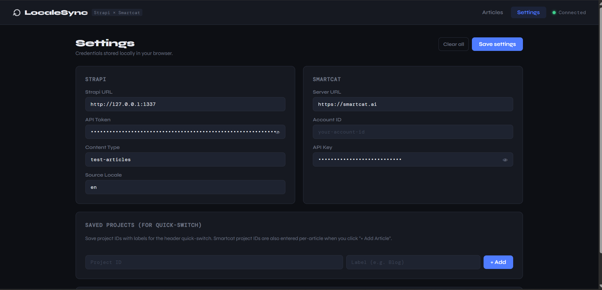

# LocaleSync

> A translation management dashboard that connects **Strapi CMS** with **Smartcat** — built for localization engineers.

LocaleSync lets you register CMS articles, push content to a Smartcat translation project, monitor per-language progress in real time, and pull completed translations back into your CMS — all from a single dashboard.

---

## Screenshots

**Articles dashboard — multiple projects, per-locale progress**


**Article detail modal — language table with live translation progress**


**Settings — credential management, stored locally in the browser**


---

## What it does

| Step | Action |
|---|---|
| 1. Register | Link a Strapi article to a Smartcat project using their IDs |
| 2. Send | Push `title`, `shortDescription`, and `body` to Smartcat in one click |
| 3. Monitor | See per-language translation progress live (TR 28%, ES 100%, RU 2%) |
| 4. Pull | Import completed translations back into Strapi as locale versions |

---

## Architecture

```
React Dashboard (Vite + React 18)
         ↕  REST API calls
Express Middleware (Node.js)
         ↕                     ↕
   Strapi CMS v5          Smartcat API v1
   (content source)       (translation engine)
```

The middleware is **credential-agnostic** — API keys are sent per-request as headers from the browser, stored in `localStorage`. Nothing is hardcoded on the server side.

---

## Tech Stack

| Layer | Technology |
|---|---|
| Frontend | React 18, Vite, vanilla CSS |
| API server | Node.js, Express |
| CMS | Strapi v5 |
| Translation platform | Smartcat API v1 |
| Credential storage | Browser localStorage |
| Article registry | JSON file (server-side) |

---

## Project Structure

```
localesync/
├── frontend/                      # React + Vite dashboard
│   └── src/
│       ├── App.jsx
│       ├── App.css
│       ├── api/
│       │   └── client.js          # API calls + credential management
│       └── components/
│           ├── ArticlesPage.jsx   # Article grid
│           ├── ArticleModal.jsx   # Register / send / pull / monitor
│           ├── Header.jsx         # Project quick-switch
│           ├── Settings.jsx       # Credential configuration
│           ├── StatusBadge.jsx
│           └── Toast.jsx
│
├── middleware/                    # Express API server
│   ├── server.js                  # All endpoints — credential-agnostic
│   ├── jobTracker.js              # Article registry (registry.json)
│   ├── strapiClient.js            # Strapi helpers
│   ├── smartcatClient.js          # Smartcat auth + export helpers
│   ├── transform.js               # Field mapping + placeholder validation
│   └── sync.js                    # Optional CLI pipeline runner
│
└── strapi-cms/                    # Local Strapi v5 instance
```

---

## Getting Started

### Prerequisites

- Node.js v20, v22, or v24
- A running Strapi v5 instance with i18n enabled
- A Smartcat account with at least one project containing uploaded documents

### 1. Clone the repo

```bash
git clone https://github.com/bunyamingenc/Smartcat-Integration-with-Strapi-CMS.git
cd Smartcat-Integration-with-Strapi-CMS
```

### 2. Start the middleware server

```bash
cd middleware
npm install
node server.js
```

Runs at `http://localhost:3000`

### 3. Start the frontend

```bash
cd frontend
npm install
npm run dev
```

Open `http://localhost:5173`

### 4. Start Strapi (separate terminal)

```bash
cd strapi-cms
npm run develop
```

Runs at `http://localhost:1337`

### 5. Configure credentials in the dashboard

Open **Settings** and fill in:

| Field | Where to find it |
|---|---|
| Strapi URL | Your Strapi instance URL (e.g. `http://localhost:1337`) |
| Strapi API Token | Strapi Admin → Settings → API Tokens → Create Full Access token |
| Content Type | Plural API ID of your content type (e.g. `articles`) |
| Source Locale | Your default language code (e.g. `en`) |
| Smartcat Server URL | `https://smartcat.ai` or `https://eu.smartcat.ai` |
| Smartcat Account ID | Smartcat → Settings → API |
| Smartcat API Key | Smartcat → Settings → API → Generate key |

### 6. Register your first article

1. Click **+ Add Article**
2. Paste the **Strapi document ID** — found in the article URL when editing in Strapi Admin
3. Paste the **Smartcat project ID** — found in the project URL: `smartcat.com/projects/{PROJECT-ID}/files`
4. Click **Register article** — the app validates both IDs before saving

### 7. Send and pull translations

- Click any article card to open the detail modal
- Click **Send to Smartcat →** to push content for translation
- Monitor per-language progress directly in the modal
- Click **↓ Pull to Strapi** to import completed (or partial) translations

---

## How content is handled

LocaleSync extracts three fields from Strapi:

- `title` — Short text
- `shortDescription` — Short text  
- `body` — Long text

Content is serialized as a **flat JSON file** and sent to Smartcat via `PUT /v1/document/update`. Translated content is pulled back using the Smartcat export API and written to Strapi locale versions via `PUT /api/{contentType}/{documentId}?locale={lang}`.

Placeholder variables in the format `{{variable_name}}` are validated before writing back to prevent broken content.

---

## Environment Variables

Create a `.env` file in `middleware/` for the optional CLI sync script:

```env
STRAPI_URL=http://localhost:1337
STRAPI_API_TOKEN=your-strapi-api-token
STRAPI_CONTENT_TYPE=articles
STRAPI_SOURCE_LOCALE=en
SMARTCAT_SERVER=https://smartcat.ai
SMARTCAT_ACCOUNT_ID=your-account-id
SMARTCAT_API_KEY=your-api-key
SMARTCAT_PROJECT_ID=your-project-id
```

The dashboard uses credentials from Settings instead — the `.env` file is only needed for `sync.js`.

---

## Roadmap

- [ ] Deploy to Railway + Vercel (publicly usable)
- [ ] PostgreSQL registry (replace `registry.json`)
- [ ] Auto-send on Strapi publish via webhook
- [ ] XLIFF format support for richer CAT tool compatibility
- [ ] Multi-user authentication
- [ ] Translation memory integration

---

## Background

Built as a practical localization engineering project exploring:

- Headless CMS architecture and i18n content workflows
- TMS (Translation Management System) API integration
- Credential-agnostic middleware design
- React dashboard patterns for localization tooling

The project demonstrates the full localization pipeline: **content extraction → TMS submission → real-time monitoring → locale injection**.

---

[github.com/bunyamingenc](https://github.com/bunyamingenc)

---

## License

MIT
